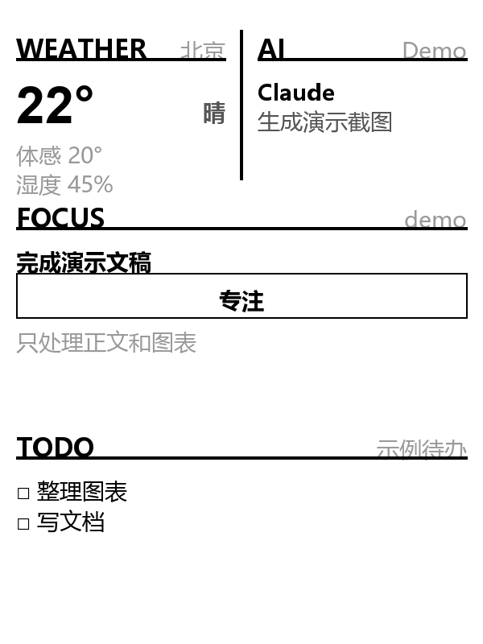

# KindleDesk Card

> 用自然语言告诉 Kindle 显示什么。Agent Skill 驱动的墨水屏副屏。

[](https://github.com/anthropics/skills)
[](./LICENSE)

## 你什么时候需要它？

1. **你有一台越狱的 Kindle 在吃灰。** 屏幕还是好的，电池还能撑一周——但它只显示"已下载"列表。
2. **你想在桌上放一块"环境信息屏"。** 天气、今天要做的三件事、AI 正在跑什么任务——一瞥就知道，不用切窗口。
3. **你已经在用 AI Agent 工作。** 不想再手动 curl API、选 slot、填 JSON。说一句"显示今天的待办和天气"，Agent 帮你搞定。

## 它会交付什么？

你说话 → Agent 选 widget 类型和位置 → 生成结构化数据 → **dry-run 校验**（默认不推送）→ 你确认后 → 推送到 Kindle 墨水屏。



*默认布局：天气 + AI 状态 + 专注 + 待办（已完成的项自动过滤）*

更多效果：

| 全屏反思 | 便签 + 系统 + 日程 |
|---|---|
|  |  |

## 快速开始

```bash
# 1. 安装 Skill
npx skills add aeluyo8-blip/kindledesk-card -g

# 2. 启动 daemon（在 kindledesk 项目目录下）
cd kindledesk && python daemon/serve.py

# 3. 试试 dry-run（不推送，只校验）
python scripts/widget.py weather --slot top-left --data-stdin <<EOF
{"location":"北京","current":{"temp":"22","feels":"20","humidity":"45","condition":"晴"}}
EOF
```

## 触发方式

对 Agent 说这些话，Skill 会自动触发：

- "显示今天的天气和待办"
- "推送一张专注卡片到 Kindle"
- "把这段便签发到副屏"
- "现在 Kindle 上显示什么？预览一下"
- "清理 Kindle 上的所有卡片"
- "从笔记里随机抽一条反问推过去"

**默认只校验不推送**——只有你说"推送/发送到 Kindle/现在显示"时才真正推送。

## 13 种 Widget

| 类型 | 用途 | 一句话 |
|---|---|---|
| `weather` | 天气 | 城市 + 温度 + 湿度 + 天气状况 |
| `clock` | 时钟 | 当前时间 |
| `focus` | 专注 | 当前唯一重要任务 |
| `todo` | 待办 | 今天要做的几件事 |
| `ai-status` | AI 状态 | Agent 当前在做什么 |
| `scratch` | 便签 | 随手记一句话 |
| `calendar` | 日程 | 今天的时间安排 |
| `quote` | 书摘 | 每日一句/名言 |
| `reading` | 阅读 | 当前读书进度 |
| `system` | 系统 | CPU/内存/磁盘/电池 |
| `countdown` | 倒计时 | 距某日期还有几天 |
| `inbox` | 消息 | 未读消息统计 |
| `reflection` | 反思 | 从笔记随机抽反问 |

## 和同类有什么不同？

| 特性 | KindleDesk Card | kindle-side-card | 其他 Kindle 副屏 |
|---|---|---|---|
| 操作方式 | **自然语言** | curl 命令 | 手动配置 |
| 默认行为 | **dry-run 校验** | 直接推送 | 直接推送 |
| Widget 类型 | 13 种 | ~8 种 | 1-3 种 |
| 笔记集成 | **Obsidian 抽取反思** | 无 | 无 |
| 已完成的 todo | **自动过滤** | 不区分 | 不区分 |
| 安装方式 | `npx skills add` | git clone + venv | git clone |

## 安全边界

- **默认不推送**：不加 `--push` 不会触碰 Kindle，只输出 JSON 到终端
- **slot 占用检测**：目标位置已有 widget 时会提示，不会擅自覆盖
- **不自动切换网络**：推送失败不会自动切 USB/SSH 或重启设备
- **不执行 Kindle 端命令**：Skill 只和 PC daemon 通信，不直接操作 Kindle
- **读写范围**：只读 Bash/Read/Write，不调用外部 API、不发送网络请求到非 daemon 地址

## 文件结构

```
kindledesk-card/
├── SKILL.md              # Agent 工作流：选 type、slot、data，推送到 daemon
├── README.md             # 你正在看的
├── LICENSE               # MIT
├── test-prompts.json     # 测试 prompt，覆盖单 widget、多 widget、边界情况
├── scripts/
│   ├── widget.py         # 校验 + 推送脚本（dry-run / preview / push / clear）
│   └── generate_demo.py  # 生成演示截图（假数据，无需 daemon）
└── examples/
    ├── usage-examples.md # 6 个真实场景示例
    ├── demo_default.png  # 默认布局演示
    ├── demo_reflection.png
    └── demo_scratch_calendar.png
```

## 前置条件

> ⚠️ 这个 Skill 只是 Agent 层——它把自然语言转成 widget 数据发给 PC daemon。要让 Kindle 真正显示卡片，还需要 KindleDesk 的完整系统。

### 硬件

- **Kindle 一台**（已越狱，Kindle Basic 3 / Paperwhite 等型号，600×800 或更高分辨率）
- **越狱工具**：Kindle 需已安装 KUAL（Kindle Unified Application Launcher）+ MRPI（MobileRead Package Installer）
- **fbink**：Kindle 上需有 fbink 工具（通常随 KOReader 安装，路径 `/mnt/us/koreader/fbink`）

### Kindle 端

Kindle 上需要部署 KUAL 扩展脚本，负责从 PC 拉取渲染好的图片并直写 `/dev/fb0`：

```
PC (serve.py) ──Wi-Fi HTTP :8000──▶ Kindle (fetch_loop)
                                     │
                                     ├─ curl /fb → cat > /dev/fb0
                                     └─ fbink -s (刷新屏幕)
```

- 主线 PULL：Kindle 每 60s 主动拉取，不依赖 SSH
- 即时推送：`POST /widget` 后下一次 pull（≤60s）生效
- 防休眠：`powerd` 配置阻止 Kindle 自动息屏

KUAL 菜单提供 Start/Stop display、Fix screensaver、Enable boot autostart 等入口。

### PC 端

```bash
# 克隆 KindleDesk 项目并启动 daemon
git clone https://github.com/kindledesk/kindledesk.git
cd kindledesk
pip install pillow
python daemon/serve.py    # 监听 0.0.0.0:8000
```

daemon 负责：
- 渲染 600×800 灰阶 PNG（Pillow）
- 2-1-1 网格组合多个 widget
- 脏区域 diff，减少 Kindle 传输量
- 天气数据自动刷新

### 网络

PC 和 Kindle 必须在同一 Wi-Fi 网络下。Kindle 端需要配置 PC 的 IP 地址（通过 KUAL → Set / show PC IP）。

### 完整安装

详细的 Kindle 越狱、KUAL 安装、扩展部署和 daemon 配置见 KindleDesk 项目仓库的 `flows/` 目录。

## 验证与测试

```bash
# 运行项目测试
cd kindledesk && python -m pytest tests/test_push_templates.py -v

# 快速验证 Skill 脚本可用
python scripts/widget.py weather --slot top-left --data-stdin <<EOF
{"location":"测试","current":{"temp":"25","feels":"26","humidity":"50","condition":"晴"}}
EOF
```

## 致谢

- **[鲁班 (luban-skill)](https://github.com/LearnPrompt/luban-skill)** — Skill 打磨工坊，本 Skill 的 README、测试 prompt、文档结构均经鲁班五步方法论打磨（验料→访行→过尺→慢刨→回炉）。
- **[ai-desk-card](https://github.com/op7418/ai-desk-card)** — 上游参考项目，Widget 系统的架构设计（slot 网格、widget 类型 catalog、daemon 渲染管线）来自 ai-desk-card 的实践经验。

## License

MIT